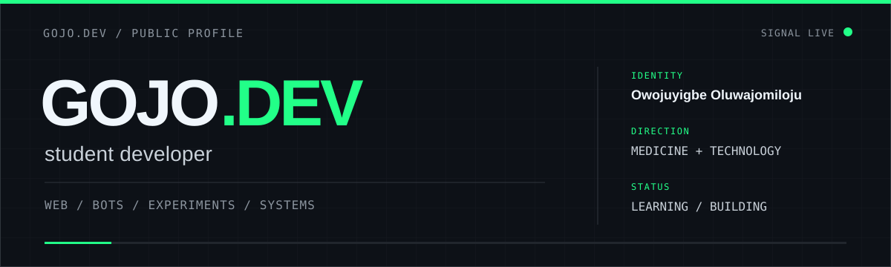
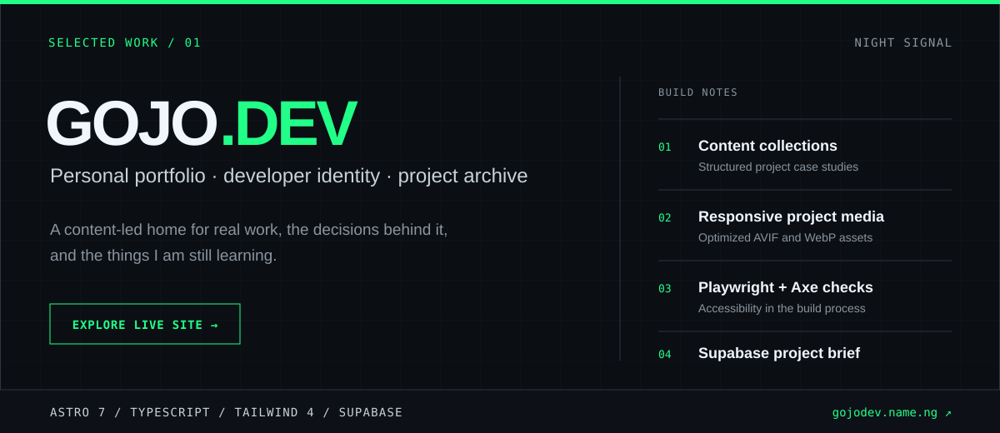

  <picture>
    <source media="(max-width: 640px)" srcset="./assets/header-mobile.svg">
    
  </picture>

  <strong>Owojuyigbe Oluwajomiloju</strong> 
  STUDENT DEVELOPER · LAGOS, NIGERIA

  <a href="#user-content-01--profile">PROFILE</a>
  &nbsp;·&nbsp;
  <a href="#user-content-02--stack">STACK</a>
  &nbsp;·&nbsp;
  <a href="#user-content-03--selected-work">WORK</a>
  &nbsp;·&nbsp;
  <a href="#user-content-04--github-activity">ACTIVITY</a>
  &nbsp;·&nbsp;
  <a href="#user-content-05--connect">CONNECT</a>

---

## `01` / Profile

I'm **Owojuyigbe Oluwajomiloju** — a student developer who likes understanding technology beyond the point where the code finally works. I build websites, bots, experiments, and side projects because turning an idea into something real is how I learn best.

I keep pulling at the layers underneath: what the runtime is doing, how the pieces connect, and why a solution behaves the way it does.

> Medicine is the career. Tech is the obsession.

<samp>NOW / JAVASCRIPT DEPTH · NODE.JS · C++ FOUNDATIONS · BOT ARCHITECTURE</samp>

---

## `02` / Stack

The labels matter here: this is a record of what I can use comfortably, what I'm actively learning, and what I've explored — not a wall of claimed expertise.

### Comfortable with

  
   
  
  
   
  
  

HTML · CSS · JavaScript · TypeScript · Node.js · Git · Bash · Arduino · ESP32 · GitHub · VS Code · Acode

### Currently learning

  
   
  

C++ · Vite · MongoDB · Blender · React · Supabase

### Familiar with

  
   
  
  

Sass · Figma · Raspberry Pi · Cisco · Astro · LaTeX

### Daily environment

  
   
  
  
  
  

Git · GitHub · VS Code · Acode · Termux · Vercel · Render · Supabase · npm · Node.js

---

## `03` / Selected work

  <a href="https://www.gojodev.name.ng/">
    <picture>
      <source media="(max-width: 640px)" srcset="./assets/gojodev-feature-mobile.svg">
      
    </picture>
  </a>

### GOJO.DEV · Night Signal

My personal portfolio and the main home for my work. It is a content-driven Astro build with structured case studies, responsive project media, accessibility checks with Playwright and Axe, search and social metadata, and a Supabase-backed project brief form.

**[Explore the live site ↗](https://www.gojodev.name.ng/)**

`Astro` `TypeScript` `Tailwind CSS` `Supabase` `Playwright`

SOURCE / PRIVATE · LIVE BUILD / PUBLIC

 

### `03.1` · ⟨∞⟩ Infinity MD

An early-stage Telegram bot built with JavaScript, Node.js, and grammY. It currently has command handlers, inline menus, user-aware replies, and centralized error handling; WhatsApp and Discord are future directions.

`JavaScript` `Node.js` `grammY`

STATUS / ACTIVE BUILD · REPOSITORY / PRIVATE

 

### `03.2` · Providence Heights

A responsive single-page school website that organizes academics, facilities, student life, admissions, and contact information into a clear public experience.

**[Visit the site ↗](https://providence-heights.vercel.app/)** · **[View source ↗](https://github.com/gojocodes-all/Providence-heights)**

`HTML` `CSS` `JavaScript` `Vercel`

---

## `04` / GitHub activity

  <picture>
    <source media="(max-width: 640px)" srcset="https://raw.githubusercontent.com/gojocodes-all/gojocodes-all/output/profile-overview-mobile.svg">
    
  </picture>

  <picture>
    <source media="(max-width: 640px)" srcset="https://raw.githubusercontent.com/gojocodes-all/gojocodes-all/output/profile-activity-mobile.svg">
    
  </picture>

Generated daily from public GitHub data by this profile repository's workflow.

### Contribution trail

  <picture>
    <source media="(prefers-color-scheme: dark)" srcset="https://raw.githubusercontent.com/gojocodes-all/gojocodes-all/output/contribution-snake-dark.svg">
    <source media="(prefers-color-scheme: light)" srcset="https://raw.githubusercontent.com/gojocodes-all/gojocodes-all/output/contribution-snake-light.svg">
    
  </picture>

---

## `05` / Connect

The portfolio is the best place to see the finished work. For project enquiries or a conversation about code, email is the clearest route.

  <strong><a href="https://www.gojodev.name.ng/">WEBSITE ↗</a></strong>
  &nbsp;·&nbsp;
  <strong><a href="https://instagram.com/gojo.the.dev">INSTAGRAM ↗</a></strong>
  &nbsp;·&nbsp;
  <strong><a href="https://www.linkedin.com/in/jomiloju-owojuyigbe-523b66414">LINKEDIN ↗</a></strong>
  &nbsp;·&nbsp;
  <strong><a href="mailto:gojo@gojodev.name.ng">EMAIL ↗</a></strong>
  &nbsp;·&nbsp;
  <strong><a href="https://github.com/gojocodes-all">GITHUB ↗</a></strong>

<samp>GOJO.DEV / BUILD CAREFULLY · LEARN CONTINUOUSLY · MAKE THE WORK USEFUL.</samp>

